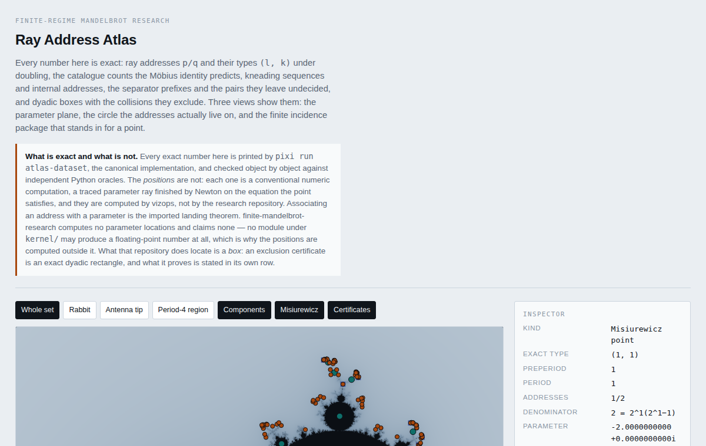
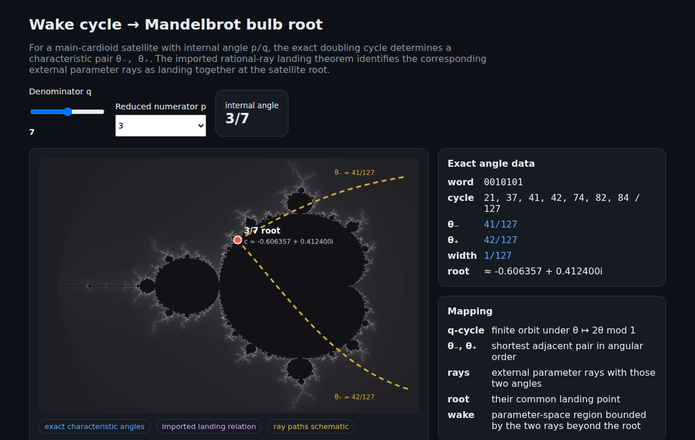
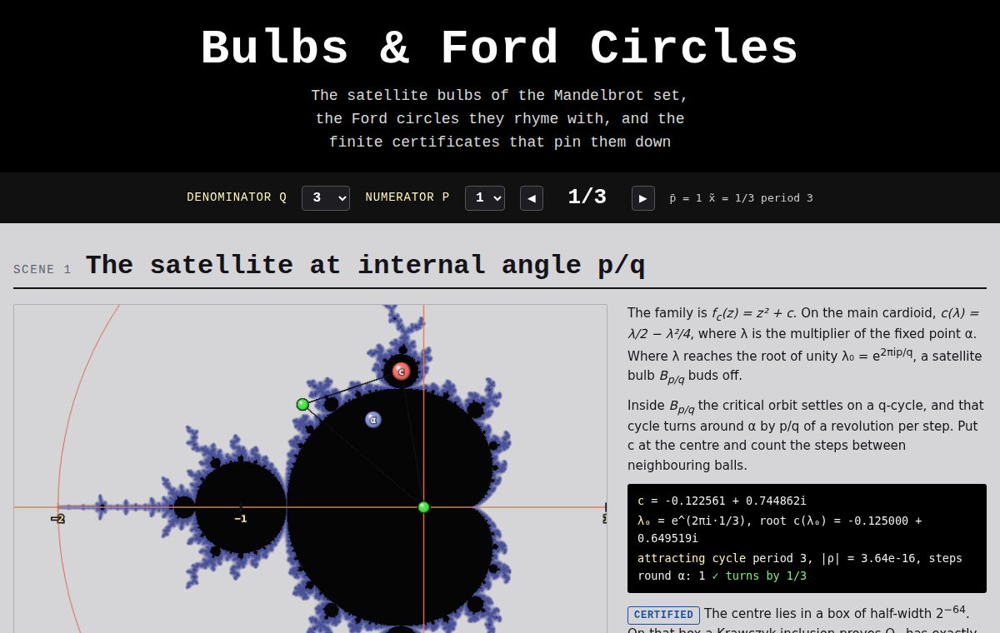
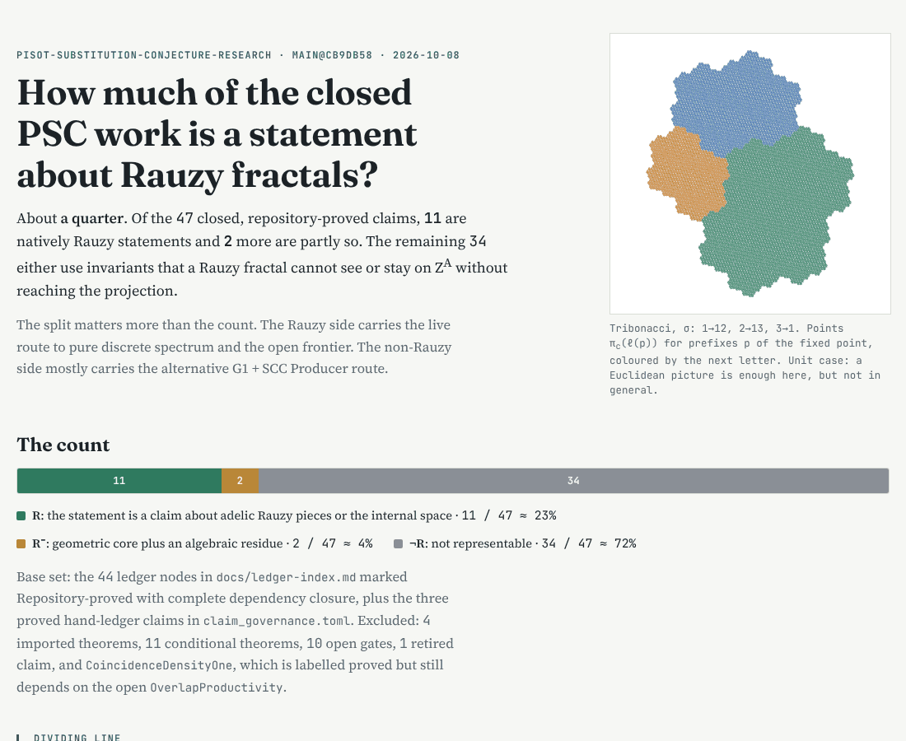

# Pages

Four surfaces are self-contained HTML pages rather than manim scenes: an
atlas, an interactive wake explorer, a six-scene tour of the satellite
bulbs, and pisot-substitution-conjecture-research's Rauzy representability
map, copied byte for byte and stamped. Each is a `[[page]]` entry in
[`vizops/sources.toml`](https://github.com/larsbx/math-vizops/blob/main/vizops/sources.toml),
built into `out/<id>.html` by `python -m vizops page <id>`, and never
committed. Open the file in a browser; [[Rendering and viewing]] covers the
command and its outcomes.

Every page is stamped with the digest of each file it read and carries the
same line a frame does: it depicts its sources at those digests and
authorizes nothing. A published copy is a snapshot of one build; rebuild and
republish it when its sources move.

<!-- BEGIN generated page gallery (python -m vizops --write); do not edit between the markers -->
<!-- Rendered by vizops/surfaces.py from the [[page]] entries in vizops/sources.toml and the stills in wiki/images/. -->

### Ray address atlas

`python -m vizops page mandelbrot-atlas` — reads [`kernel/mojo/entrypoints/atlas_dataset.mojo`](https://github.com/larsbx/finite-mandelbrot-research/blob/main/kernel/mojo/entrypoints/atlas_dataset.mojo) in `larsbx/finite-mandelbrot-research`.

**View it:** [Ray address atlas](https://claude.ai/artifact/9LDj75kM1AFBjZLmDxuFgA) — a published build, private to its owner until shared.

> The exact sections are that emitter's, checked against the Python oracles by tests/test_atlas_dataset.py; the positions are traced by vizops/atlas/trace.py and are a placement, not a claim.

### Wake cycle to Mandelbrot bulb root

`python -m vizops page wake-to-mandelbrot` — reads [`oracles/rational_dynamics_py`](https://github.com/larsbx/finite-math-kernels/tree/9d27bc4508844e72ffc61acb8ba172f7346707d8/oracles/rational_dynamics_py) in `larsbx/finite-math-kernels` (vendored at `9d27bc450884`).

> Rotation words, doubling cycles and characteristic pairs are the vendored rational_dynamics_py's (ported from the bulbs repository's kernel/bulbford/wake.py); the raster, the root coordinate and the dashed rays are display aids. The landing relation is the imported [DH/Mil00].

### Bulbs & Ford Circles

`python -m vizops page bulbs-and-ford-circles` — reads [`experiments/data/center_certificates.json`](https://github.com/larsbx/mandelbrot-bulbs-and-ford-circles-research/blob/main/experiments/data/center_certificates.json) in `larsbx/mandelbrot-bulbs-and-ford-circles-research`, [`experiments/data/antipode_certificates.json`](https://github.com/larsbx/mandelbrot-bulbs-and-ford-circles-research/blob/main/experiments/data/antipode_certificates.json) in `larsbx/mandelbrot-bulbs-and-ford-circles-research`, [`experiments/data/kappa_q1009.json`](https://github.com/larsbx/mandelbrot-bulbs-and-ford-circles-research/blob/main/experiments/data/kappa_q1009.json) in `larsbx/mandelbrot-bulbs-and-ford-circles-research`, [`conformance/cyclotomic_germ_v1.json`](https://github.com/larsbx/finite-math-kernels/blob/main/conformance/cyclotomic_germ_v1.json) in `larsbx/finite-math-kernels`.

**View it:** [Bulbs & Ford Circles](https://claude.ai/artifact/X6cYWjyUe8VZLRL75dorKh) — a published build, private to its owner until shared.

> Certified centre and antipode boxes, G brackets and the q = 1009 sweep are that repository's; the exact indices are finite-math-kernels' cyclotomic germ vectors. The page transcribes them; every certificate it shows was issued upstream.

### PSC Rauzy representability

`python -m vizops page psc-rauzy-representability` — reads [`docs/rauzy-representability-2026-10-08.html`](https://github.com/larsbx/pisot-substitution-conjecture-research/blob/main/docs/rauzy-representability-2026-10-08.html) in `larsbx/pisot-substitution-conjecture-research`.

**View it:** [PSC Rauzy representability](https://claude.ai/artifact/6gdPGTXbt68XLNdQ4KqSbt) — a published build, private to its owner until shared.

> The classification of the closed claims and the figures are that repository's page, copied byte for byte; it is an interpretive map with no ledger status there, and vizops adds only the stamp.

### Mandelbrot Names Atlas

`python -m vizops page mandelbrot-names-atlas` — reads [`docs/structure_crosswalk.json`](https://github.com/larsbx/finite-mandelbrot-research/blob/main/docs/structure_crosswalk.json) in `larsbx/finite-mandelbrot-research`.

**View it:** [Mandelbrot Names Atlas](https://claude.ai/artifact/GZGWVWFaFeBrE3Uy63PsnF) — a published build, private to its owner until shared.

_No still published yet._ Build the page, capture it, and commit `wiki/images/mandelbrot-names-atlas.png`.

> The names, exact keys, atlas relations and code occurrences are that repository's structure crosswalk, generated by tools/make_structure_crosswalk.py and checked against the atlas and the files it names; the angle circle draws the exact root angles at display positions. That a ray pair lands at a component is the imported landing theorem.

<!-- END generated page gallery -->
